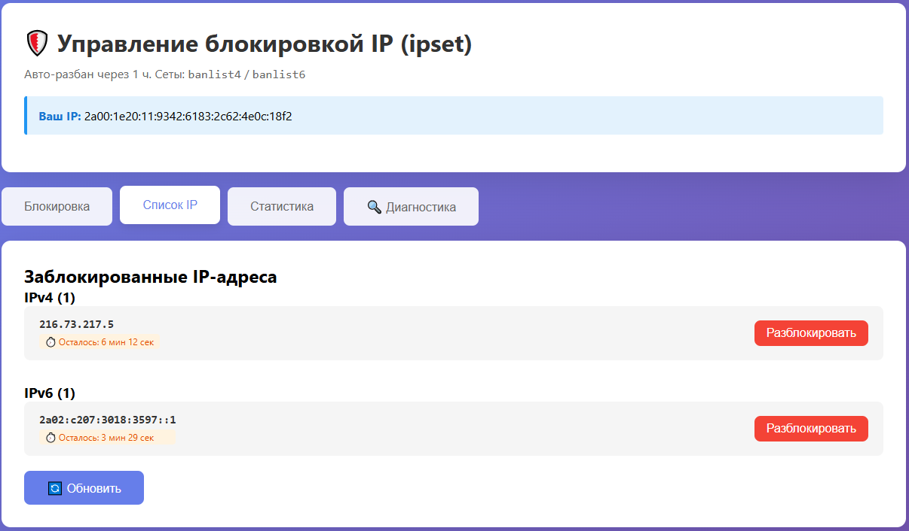

# murkir-ipset-api

**PHP API и веб-интерфейс для блокировки IPv4/IPv6 через `ipset`** с авто-разбаном на уровне ядра Linux. Один файл, без cron, без cleanup-скриптов, без composer.

Часть экосистемы [MurKir Security](#связанные-проекты).

---

## 📋 Содержание

- [Почему ipset](#почему-ipset)
- [Возможности](#возможности)
- [Требования](#требования)
  - [Операционная система](#операционная-система)
  - [Пакеты](#пакеты)
  - [PHP](#php)
  - [Функции PHP](#функции-php-которые-должны-быть-доступны)
  - [Веб-сервер](#веб-сервер)
  - [Совместимость с окружениями](#совместимость-с-окружениями)
- [Установка](#установка)
- [API — полный справочник](#api--полный-справочник)
  - [Общие правила](#общие-правила)
  - [1. block — заблокировать IP](#1-block--заблокировать-ip)
  - [2. unblock — разблокировать IP](#2-unblock--разблокировать-ip)
  - [3. list — список IPv4](#3-list--список-заблокированных-ipv4)
  - [4. list6 — список IPv6](#4-list6--список-заблокированных-ipv6)
  - [5. clear — снять все баны](#5-clear--снять-все-баны)
  - [6. debug — отладка](#6-debug--отладочная-информация)
  - [7. diag — диагностика](#7-diag--диагностика-окружения)
  - [8. init — инициализация](#8-init--принудительная-инициализация)
- [Интеграция](#интеграция)
  - [PHP](#php-1)
  - [Bash / curl](#bash--curl)
  - [Python](#python)
  - [Node.js](#nodejs)
- [Веб-интерфейс](#веб-интерфейс)
- [Диагностика](#диагностика)
- [Конфигурация](#конфигурация)
- [Безопасность](#безопасность)
- [Как это работает](#как-это-работает)
- [FAQ](#faq)
- [Тесты](#тесты)
- [Структура репозитория](#структура-репозитория)
- [Лицензия](#лицензия)
- [Связанные проекты](#связанные-проекты)

---

## Почему ipset

Типичная схема банов через `iptables -I INPUT -s X -j DROP` быстро деградирует при тысячах правил — ядро линейно проверяет каждый пакет против всего списка.

`ipset` использует хэш-таблицу в ядре: проверка **O(1)** независимо от количества записей. Миллион забаненных IP — такая же скорость, как десять.

**Плюс авто-разбан:** у каждой записи свой `timeout`, ядро удаляет просроченные элементы само. Никакого `cron`, никакого `at`, никакого `cleanup.php`. Заблокировал IP на час — через час он разблокируется сам, без твоего участия.

---

## Возможности

- 🔥 Блокировка **IPv4 и IPv6** через единый API
- ⏱️ **Индивидуальный таймаут** для каждого бана (по умолчанию 1 час)
- 🧹 **Авто-разбан выполняет ядро** — без внешних скриптов
- 🌐 **Веб-интерфейс** с четырьмя вкладками: блокировка, список, статистика, диагностика
- 📊 Отображение **оставшегося времени** для каждого забаненного IP
- 🔍 **Встроенная диагностика системы** с подсказками что именно не так и как исправить
- ⚡ **Кнопка «Инициализировать»** для ручного создания сетов и правил
- 🛡️ Защита от shell-injection (`filter_var` + `escapeshellarg`)
- 🔐 **Timing-safe** сравнение API-ключа (`hash_equals`)
- 📦 **Один PHP-файл**, совместим с PHP 5.6–8.3
- 🔄 **Переживает reboot** — при старте PHP пересоздаёт сеты и правила автоматически
- 🚀 **Работает с отключенным `shell_exec`** (критичные функции — только `exec`)

---

## Требования

Минимальный набор для работы. Все проверки автоматизированы на вкладке **🔍 Диагностика** — при первом открытии UI она покажет что не настроено и как это исправить.

### Операционная система

- **Linux** с ядром 3.13+ (Ubuntu 14.04+, Debian 8+, CentOS 7+, RHEL 7+, Alpine 3.x)
- Поддержка netfilter в ядре — есть по умолчанию во всех дистрибутивах
- Модуль ядра `xt_set` — загружается автоматически при первом использовании `ipset`, или вручную: `sudo modprobe xt_set`

**Не подходит:** shared-хостинги без доступа к `sudo` и iptables, контейнеры без `CAP_NET_ADMIN`, Windows.

### Пакеты

```bash
# Ubuntu / Debian
sudo apt install ipset iptables sudo

# CentOS / RHEL / AlmaLinux / Rocky
sudo yum install ipset iptables sudo

# Alpine
apk add ipset iptables sudo
```

`iptables` и `ip6tables` обычно уже установлены.

### PHP

- **Версия: 5.6 или новее** (протестировано на 5.6, 7.0–7.4, 8.0–8.3)
- **Расширения** — все стандартные:
  - `ext/filter` (проверка IP через `filter_var`)
  - `ext/hash` (timing-safe сравнение ключа через `hash_equals`)
  - `ext/json` (кодирование ответов API)
  - `ext/posix` — опционально, для определения реального пользователя PHP в диагностике

### Функции PHP, которые должны быть доступны

Проверь `php.ini` → директиву `disable_functions`. Эти функции **не должны** быть в списке:

| Функция | Зачем нужна | Критично |
|---|---|---|
| `exec` | Выполнение команд `ipset`/`iptables` | ❌ без неё скрипт не работает |
| `escapeshellarg` | Экранирование IP в shell-команде | ❌ защита от injection |
| `filter_var` | Валидация IPv4/IPv6 | ❌ |
| `hash_equals` | Защита API-ключа от timing-атак | ⚠️ желательно |
| `posix_geteuid` | Определение пользователя PHP в диагностике | ⚠️ опционально |

**Что можно отключать без проблем** (наоборот, рекомендуется для безопасности): `shell_exec`, `system`, `passthru`, `popen`, `proc_open`, `eval`. Скрипт их не использует.

### Веб-сервер

Любой, умеющий запускать PHP:

- **nginx + PHP-FPM** — рекомендуемая связка
- **Apache + mod_php / PHP-FPM**
- **LiteSpeed / OpenLiteSpeed**
- **Caddy + PHP-FPM**

Специальной конфигурации не требуется.

### Совместимость с окружениями

| Окружение | Работает |
|---|---|
| Железный сервер / VDS / VPS | ✅ Да |
| KVM / Xen / VMware | ✅ Да |
| OpenVZ (старые версии) | ⚠️ Только если хостер разрешил `ipset` и загрузку `xt_set` |
| LXC-контейнер с `CAP_NET_ADMIN` | ✅ Да |
| Docker с `--cap-add=NET_ADMIN --cap-add=NET_RAW` | ✅ Да |
| Docker обычный | ❌ Нет прав на изменение правил ядра |
| Shared-хостинг | ❌ Обычно нет `sudo` и iptables |

---

## Установка

### 1. Клонирование

```bash
cd /var/www/your-site/
git clone https://github.com/Murkirpus/murkir-ipset-api.git dos
cd dos
```

Или просто скачай `iptables.php` и `settings.php` в нужную папку.

### 2. Зависимости

```bash
sudo apt install -y ipset  # Ubuntu/Debian
# или
sudo yum install -y ipset  # RHEL/CentOS
```

### 3. API-ключ

Сгенерируй сильный ключ:

```bash
openssl rand -hex 24
```

Открой `settings.php` и вставь результат:

```php
define('API_BLOCK_KEY', 'твой-сгенерированный-ключ');
```

### 4. sudoers

Пользователь, под которым работает PHP-FPM (обычно `www-data`, `nginx`, `apache` или `php`), должен запускать три команды через `sudo` без пароля. Узнать пользователя:

```bash
ps aux | grep php-fpm | grep -v root | head -1 | awk '{print $1}'
```

Или открой диагностику в UI — она покажет поле **«Пользователь PHP»**.

Создай файл `/etc/sudoers.d/iptables-api`:

```
Cmnd_Alias IPSET_CMDS = /usr/sbin/ipset, /sbin/ipset, /bin/ipset
Cmnd_Alias IPT4_CMDS  = /sbin/iptables, /usr/sbin/iptables
Cmnd_Alias IPT6_CMDS  = /sbin/ip6tables, /usr/sbin/ip6tables

www-data ALL=(root) NOPASSWD: IPSET_CMDS, IPT4_CMDS, IPT6_CMDS
```

Замени `www-data` на имя своего пользователя. Затем:

```bash
sudo chmod 440 /etc/sudoers.d/iptables-api
sudo visudo -cf /etc/sudoers.d/iptables-api  # проверка синтаксиса
```

### 5. Проверка

Открой в браузере:

```
https://your-domain.com/dos/iptables.php?api_key=ТВОЙ_КЛЮЧ
```

Если есть критичные ошибки — скрипт автоматически откроет вкладку **🔍 Диагностика** с подробными подсказками.

Если всё зелёное — нажми **⚡ Инициализировать сеты и правила**, и система готова к работе.

---

## API — полный справочник

### Общие правила

**Базовый URL:**
```
https://your-domain.com/path/to/iptables.php
```

**Обязательные параметры для ВСЕХ запросов:**
- `api_key=ТВОЙ_КЛЮЧ` — API-ключ из `settings.php`
- `api=1` — для получения JSON-ответа (без него вернётся HTML интерфейс)

**Методы HTTP:** GET и POST работают идентично. POST предпочтительнее для боевых интеграций (ключ не попадает в access-log в параметрах URL).

**Формат ответов:** JSON с UTF-8 (поддержка кириллицы), Content-Type: `application/json`.

**Статус-коды:**
- `200` — запрос обработан (смотри `status` внутри JSON)
- `403` — неверный API-ключ

**Таблица всех endpoints:**

| # | Action | Параметры | Описание |
|---|---|---|---|
| 1 | `block` | `ip`, `timeout` (опц.) | Заблокировать IP с таймаутом |
| 2 | `unblock` | `ip` | Снять бан досрочно |
| 3 | `list` | — | Список заблокированных IPv4 |
| 4 | `list6` | — | Список заблокированных IPv6 |
| 5 | `clear` | — | Снять все баны |
| 6 | `debug` | — | Полная информация о правилах и сетах |
| 7 | `diag` | — | Диагностика окружения |
| 8 | `init` | — | Принудительная инициализация сетов и правил |

---

### 1. `block` — заблокировать IP

Добавляет IP в соответствующий сет (`banlist4` или `banlist6`) с указанным таймаутом. Определение IPv4/IPv6 автоматическое.

**Параметры:**

| Параметр | Тип | Обязательный | Описание |
|---|---|---|---|
| `action` | string | ✅ | `block` |
| `ip` | string | ✅ | IPv4 или IPv6 адрес |
| `timeout` | integer | ❌ | Секунды до авто-разбана (по умолчанию 3600) |
| `api` | integer | ✅ | `1` для JSON-ответа |
| `api_key` | string | ✅ | API-ключ |

**Примеры:**

```bash
# Бан на 1 час (дефолт)
curl "https://site/dos/iptables.php?action=block&ip=1.2.3.4&api=1&api_key=KEY"

# Бан на 2 часа
curl "https://site/dos/iptables.php?action=block&ip=1.2.3.4&timeout=7200&api=1&api_key=KEY"

# Бан IPv6 на 30 минут
curl "https://site/dos/iptables.php?action=block&ip=2001:db8::1&timeout=1800&api=1&api_key=KEY"

# Бан на сутки через POST
curl -X POST "https://site/dos/iptables.php" \
  -d "action=block&ip=1.2.3.4&timeout=86400&api=1&api_key=KEY"
```

**Успешный ответ:**

```json
{
  "status": "success",
  "message": "IP 1.2.3.4 заблокирован на 1 ч",
  "details": "Set: banlist4, timeout: 3600 сек"
}
```

**Ошибки:**

```json
{
  "status": "error",
  "message": "Неверный формат IP: abc.def"
}
```

**Шпаргалка по таймаутам:**

| Длительность | Секунд |
|---|---|
| 1 минута | `60` |
| 5 минут | `300` |
| 10 минут | `600` |
| 30 минут | `1800` |
| 1 час | `3600` |
| 6 часов | `21600` |
| 12 часов | `43200` |
| 1 сутки | `86400` |
| 1 неделя | `604800` |
| 30 суток | `2592000` |
| 1 год | `31536000` (максимум) |

**Продление бана:** повторный вызов `block` с тем же IP перезапишет таймаут. Не нужно сначала `unblock`.

```bash
# IP забанен на 10 минут, через 3 минуты делаем это:
curl "https://site/dos/iptables.php?action=block&ip=1.2.3.4&timeout=3600&api=1&api_key=KEY"
# Теперь ему сидеть час от этого момента, а не 7 минут
```

---

### 2. `unblock` — разблокировать IP

Удаляет IP из сета досрочно.

**Параметры:**

| Параметр | Тип | Обязательный | Описание |
|---|---|---|---|
| `action` | string | ✅ | `unblock` |
| `ip` | string | ✅ | IPv4 или IPv6 адрес |
| `api` | integer | ✅ | `1` |
| `api_key` | string | ✅ | API-ключ |

**Примеры:**

```bash
# Разбан IPv4
curl "https://site/dos/iptables.php?action=unblock&ip=1.2.3.4&api=1&api_key=KEY"

# Разбан IPv6
curl "https://site/dos/iptables.php?action=unblock&ip=2001:db8::1&api=1&api_key=KEY"
```

**Успешный ответ:**

```json
{
  "status": "success",
  "message": "IP 1.2.3.4 успешно разблокирован",
  "details": "Удалён из banlist4"
}
```

**Если IP не был в списке:**

```json
{
  "status": "warning",
  "message": "IP 1.2.3.4 не найден в списке или уже разблокирован"
}
```

---

### 3. `list` — список заблокированных IPv4

Возвращает все забаненные IPv4-адреса с оставшимся временем бана.

**Параметры:**

| Параметр | Тип | Обязательный | Описание |
|---|---|---|---|
| `action` | string | ✅ | `list` |
| `api` | integer | ✅ | `1` |
| `api_key` | string | ✅ | API-ключ |

**Пример:**

```bash
curl "https://site/dos/iptables.php?action=list&api=1&api_key=KEY"
```

**Ответ:**

```json
{
  "status": "success",
  "version": "IPv4",
  "set": "banlist4",
  "count": 2,
  "blocked_ips": ["1.2.3.4", "5.6.7.8"],
  "blocked_details": [
    {
      "ip": "1.2.3.4",
      "ports": ["all"],
      "remaining": 3412,
      "remaining_human": "56 мин 52 сек"
    },
    {
      "ip": "5.6.7.8",
      "ports": ["all"],
      "remaining": 120,
      "remaining_human": "2 мин"
    }
  ]
}
```

**Поля:**
- `count` — количество забаненных IP
- `blocked_ips` — простой массив адресов (для обратной совместимости)
- `blocked_details[].remaining` — секунд до авто-разбана
- `blocked_details[].remaining_human` — форматированная строка

---

### 4. `list6` — список заблокированных IPv6

Аналогично `list`, но для IPv6-адресов из сета `banlist6`.

**Пример:**

```bash
curl "https://site/dos/iptables.php?action=list6&api=1&api_key=KEY"
```

**Ответ:**

```json
{
  "status": "success",
  "version": "IPv6",
  "set": "banlist6",
  "count": 1,
  "blocked_ips": ["2001:db8::1"],
  "blocked_details": [
    {
      "ip": "2001:db8::1",
      "ports": ["all"],
      "remaining": 1800,
      "remaining_human": "30 мин"
    }
  ]
}
```

---

### 5. `clear` — снять все баны

Полностью очищает оба сета: `banlist4` и `banlist6`.

**Параметры:**

| Параметр | Тип | Обязательный | Описание |
|---|---|---|---|
| `action` | string | ✅ | `clear` |
| `api` | integer | ✅ | `1` |
| `api_key` | string | ✅ | API-ключ |

**Пример:**

```bash
curl "https://site/dos/iptables.php?action=clear&api=1&api_key=KEY"
```

**Ответ:**

```json
{
  "status": "success",
  "message": "Все баны сняты",
  "details": "banlist4 очищен, banlist6 очищен"
}
```

⚠️ **Осторожно:** операция необратимая. Все текущие баны будут удалены.

---

### 6. `debug` — отладочная информация

Возвращает полную внутреннюю информацию о правилах iptables, содержимом сетов и системных настройках.

**Пример:**

```bash
curl "https://site/dos/iptables.php?action=debug&api=1&api_key=KEY"
```

**Ответ:**

```json
{
  "status": "success",
  "debug_info": {
    "ipset_banlist4": "Name: banlist4\nType: hash:ip\nRevision: 4\n...",
    "ipset_banlist6": "Name: banlist6\nType: hash:ip\nHeader: family inet6...",
    "iptables_ipv4": "Chain INPUT (policy ACCEPT)\n...",
    "iptables_ipv6": "Chain INPUT (policy ACCEPT)\n...",
    "default_timeout": 3600,
    "blocked_ipv4": { "count": 2, "blocked_ips": ["..."] },
    "blocked_ipv6": { "count": 0, "blocked_ips": [] }
  }
}
```

Используется для диагностики и отладки — видно «сырой» вывод `ipset list` и `iptables -L`.

---

### 7. `diag` — диагностика окружения

Проверяет 17+ компонентов системы, необходимых для работы скрипта. Возвращает список проверок со статусами и подсказками.

**Пример:**

```bash
curl "https://site/dos/iptables.php?action=diag&api=1&api_key=KEY"
```

**Ответ:**

```json
{
  "status": "warn",
  "can_init": true,
  "summary": "Есть предупреждения. Нажми «Инициализировать» чтобы создать сеты и правила.",
  "checks": [
    {
      "name": "Версия PHP",
      "status": "ok",
      "value": "8.3.6",
      "hint": "Требуется PHP 5.6 или новее"
    },
    {
      "name": "Функция exec()",
      "status": "ok",
      "value": "доступна",
      "hint": ""
    },
    {
      "name": "Бинарник ipset",
      "status": "ok",
      "value": "/usr/sbin/ipset",
      "hint": ""
    },
    {
      "name": "sudoers: ipset",
      "status": "fail",
      "value": "требует пароль",
      "hint": "sudoers не настроен для NOPASSWD. Создай /etc/sudoers.d/iptables-api: ..."
    },
    {
      "name": "ipset: banlist4",
      "status": "warn",
      "value": "не создан",
      "hint": "Будет создан автоматически при первой блокировке IPv4"
    }
  ]
}
```

**Поля:**

- `status` — общий статус (`ok` / `warn` / `fail`)
- `can_init` — можно ли вызвать `action=init` (true если только warn-и, нет fail-ов)
- `summary` — краткая сводка для показа пользователю
- `checks[]` — массив проверок:
  - `name` — название проверки
  - `status` — `ok` / `warn` / `fail`
  - `value` — значение (версия, путь к файлу, сообщение об ошибке)
  - `hint` — подсказка как исправить (с командами)

**Что именно проверяется:**

| Категория | Что |
|---|---|
| PHP | Версия, `exec`, `escapeshellarg`, `filter_var`, `hash_equals` |
| Бинарники | `sudo`, `ipset`, `iptables`, `ip6tables` + их пути |
| Ядро | Модуль `xt_set` загружен |
| sudoers | `sudo -n ipset/iptables/ip6tables` работает без пароля |
| Контекст | Реальный пользователь PHP |
| ipset состояние | Существуют ли сеты `banlist4` / `banlist6` |
| iptables правила | Установлены ли DROP-правила в INPUT |
| Файловая система | Запись в `/tmp` доступна |

---

### 8. `init` — принудительная инициализация

Создаёт сеты и правила прямо сейчас, не дожидаясь первой блокировки. Идемпотентно — повторный вызов безопасен.

**Пример:**

```bash
curl "https://site/dos/iptables.php?action=init&api=1&api_key=KEY"
```

**Ответ при первой инициализации:**

```json
{
  "status": "success",
  "message": "Инициализация завершена",
  "details": "✅ Создан сет banlist4\n✅ Создан сет banlist6\n✅ Создано правило iptables INPUT\n✅ Создано правило ip6tables INPUT"
}
```

**Ответ при повторной инициализации:**

```json
{
  "status": "success",
  "message": "Инициализация завершена",
  "details": "✓ banlist4 уже существует\n✓ banlist6 уже существует\n✓ Правило iptables INPUT уже существует\n✓ Правило ip6tables INPUT уже существует"
}
```

**Ответ с ошибкой sudoers:**

```json
{
  "status": "error",
  "message": "Инициализация с ошибками",
  "details": "❌ Не удалось создать banlist4: sudo: password is required\n..."
}
```

---

## Интеграция

### PHP

```php
<?php
/**
 * Универсальный клиент для murkir-ipset-api
 */
class IpsetClient
{
    private $url;
    private $apiKey;

    public function __construct(string $url, string $apiKey)
    {
        $this->url    = rtrim($url, '/');
        $this->apiKey = $apiKey;
    }

    public function block(string $ip, int $timeout = 3600): array
    {
        return $this->request('block', ['ip' => $ip, 'timeout' => $timeout]);
    }

    public function unblock(string $ip): array
    {
        return $this->request('unblock', ['ip' => $ip]);
    }

    public function list(int $version = 4): array
    {
        return $this->request($version === 6 ? 'list6' : 'list');
    }

    public function clear(): array
    {
        return $this->request('clear');
    }

    public function diag(): array
    {
        return $this->request('diag');
    }

    private function request(string $action, array $params = []): array
    {
        $params = array_merge($params, [
            'action'  => $action,
            'api'     => 1,
            'api_key' => $this->apiKey,
        ]);

        $ctx = stream_context_create(['http' => [
            'method'        => 'POST',
            'header'        => 'Content-Type: application/x-www-form-urlencoded',
            'content'       => http_build_query($params),
            'timeout'       => 3,
            'ignore_errors' => true,
        ]]);

        $body = @file_get_contents($this->url, false, $ctx);
        return json_decode($body, true) ?: ['status' => 'error', 'message' => 'Нет ответа'];
    }
}

// Использование
$ipset = new IpsetClient('https://site/dos/iptables.php', 'ТВОЙ_КЛЮЧ');

// Прогрессивный бан для MurKir Security
$nViolations = getViolationCount($ip); // твоя функция

if ($nViolations === 1)      $ipset->block($ip, 600);    // 10 минут
elseif ($nViolations === 2)  $ipset->block($ip, 3600);   // 1 час
elseif ($nViolations >= 3)   $ipset->block($ip, 86400);  // 1 сутки

// Проверка работоспособности
$diag = $ipset->diag();
if ($diag['status'] === 'fail') {
    foreach ($diag['checks'] as $c) {
        if ($c['status'] === 'fail') error_log("IPSET FAIL: {$c['name']} — {$c['hint']}");
    }
}
```

### Bash / curl

```bash
#!/bin/bash
# ipset-client.sh - обёртка для CLI

IPSET_URL="https://site/dos/iptables.php"
IPSET_KEY="ТВОЙ_КЛЮЧ"

ipset_block() {
    local ip="$1"
    local timeout="${2:-3600}"
    curl -s "$IPSET_URL?action=block&ip=$ip&timeout=$timeout&api=1&api_key=$IPSET_KEY"
}

ipset_unblock() {
    curl -s "$IPSET_URL?action=unblock&ip=$1&api=1&api_key=$IPSET_KEY"
}

ipset_list() {
    curl -s "$IPSET_URL?action=list&api=1&api_key=$IPSET_KEY" | jq
}

ipset_clear() {
    curl -s "$IPSET_URL?action=clear&api=1&api_key=$IPSET_KEY"
}

# Использование
case "$1" in
    block)   ipset_block "$2" "$3" ;;
    unblock) ipset_unblock "$2" ;;
    list)    ipset_list ;;
    clear)   ipset_clear ;;
    *)       echo "Usage: $0 {block IP [TIMEOUT]|unblock IP|list|clear}" ;;
esac
```

Использование:

```bash
./ipset-client.sh block 1.2.3.4 3600
./ipset-client.sh unblock 1.2.3.4
./ipset-client.sh list
```

### Python

```python
import requests
from typing import Optional

class IpsetClient:
    def __init__(self, url: str, api_key: str, timeout: int = 3):
        self.url = url
        self.api_key = api_key
        self.timeout = timeout

    def block(self, ip: str, timeout: int = 3600) -> dict:
        return self._request('block', {'ip': ip, 'timeout': timeout})

    def unblock(self, ip: str) -> dict:
        return self._request('unblock', {'ip': ip})

    def list(self, version: int = 4) -> dict:
        action = 'list6' if version == 6 else 'list'
        return self._request(action)

    def clear(self) -> dict:
        return self._request('clear')

    def diag(self) -> dict:
        return self._request('diag')

    def _request(self, action: str, params: Optional[dict] = None) -> dict:
        data = {'action': action, 'api': 1, 'api_key': self.api_key}
        if params:
            data.update(params)
        try:
            r = requests.post(self.url, data=data, timeout=self.timeout)
            return r.json()
        except Exception as e:
            return {'status': 'error', 'message': str(e)}


# Использование
ipset = IpsetClient('https://site/dos/iptables.php', 'ТВОЙ_КЛЮЧ')

# Бан
result = ipset.block('1.2.3.4', timeout=3600)
print(result['message'])

# Список
blocked = ipset.list(version=4)
for item in blocked['blocked_details']:
    print(f"{item['ip']} — осталось {item['remaining_human']}")
```

### Node.js

```javascript
const https = require('https');
const querystring = require('querystring');

class IpsetClient {
    constructor(url, apiKey) {
        this.url = new URL(url);
        this.apiKey = apiKey;
    }

    block(ip, timeout = 3600) {
        return this._request('block', { ip, timeout });
    }

    unblock(ip) {
        return this._request('unblock', { ip });
    }

    list(version = 4) {
        return this._request(version === 6 ? 'list6' : 'list');
    }

    clear() {
        return this._request('clear');
    }

    diag() {
        return this._request('diag');
    }

    _request(action, params = {}) {
        return new Promise((resolve, reject) => {
            const data = querystring.stringify({
                ...params,
                action,
                api: 1,
                api_key: this.apiKey,
            });

            const req = https.request({
                hostname: this.url.hostname,
                port: this.url.port || 443,
                path: this.url.pathname,
                method: 'POST',
                headers: {
                    'Content-Type': 'application/x-www-form-urlencoded',
                    'Content-Length': Buffer.byteLength(data),
                },
                timeout: 3000,
            }, (res) => {
                let body = '';
                res.on('data', (chunk) => body += chunk);
                res.on('end', () => {
                    try { resolve(JSON.parse(body)); }
                    catch (e) { reject(e); }
                });
            });

            req.on('error', reject);
            req.write(data);
            req.end();
        });
    }
}

// Использование
const ipset = new IpsetClient('https://site/dos/iptables.php', 'ТВОЙ_КЛЮЧ');

(async () => {
    const result = await ipset.block('1.2.3.4', 3600);
    console.log(result.message);

    const blocked = await ipset.list(4);
    blocked.blocked_details.forEach(item => {
        console.log(`${item.ip} — осталось ${item.remaining_human}`);
    });
})();
```

---

## Веб-интерфейс

Открой в браузере:

```
https://your-site/dos/iptables.php?api_key=ТВОЙ_КЛЮЧ
```

Четыре вкладки:

**🔒 Блокировка** — ручной ввод IP и таймаута. Кнопки: Заблокировать / Разблокировать. Быстрые действия: «Заблокировать мой IP» и «Снять все баны».

**📋 Список IP** — все заблокированные адреса с оставшимся временем для каждого. AJAX-обновление. У каждой записи кнопка «Разблокировать».

**📊 Статистика** — счётчики IPv4 / IPv6 / всего.

**🔍 Диагностика** — 17+ проверок окружения с подсказками. Если при загрузке UI есть критичные проблемы (`fail`) — автоматически переключается на эту вкладку.

---

## Диагностика

Автоматически проверяется при открытии UI. Если хоть одна проверка критична (❌) — UI сразу открывает эту вкладку.

### Типы статусов

- ✅ **ok** — всё в порядке
- ⚠️ **warn** — предупреждение, но работать будет (например, сет ещё не создан — создастся при первой блокировке)
- ❌ **fail** — критично, нужно исправить перед использованием

### Подсказки

Для каждой проблемы диагностика выдаёт конкретную команду:

- Нет `ipset`? → `sudo apt install ipset`
- sudoers не настроен? → готовый блок для `/etc/sudoers.d/iptables-api` **с твоим именем пользователя уже подставленным**
- Сет не создан? → кнопка «⚡ Инициализировать сеты и правила»

---

## Конфигурация

Файл `settings.php`:

```php
<?php
// Обязательно
define('API_BLOCK_KEY', 'your-strong-key-here');

// Опционально (раскомментируй если нужно переопределить дефолты)
// define('BAN_TIMEOUT', 3600);           // таймаут по умолчанию, сек
// define('IPSET_V4', 'banlist4');        // имена сетов
// define('IPSET_V6', 'banlist6');
// define('IPSET_MAXELEM', 1000000);      // предел записей в сете
```

Никаких других настроек для базовой работы не требуется.

---

## Безопасность

- **API-ключ обязателен** — без него 403 на любой запрос, включая веб-интерфейс
- **`hash_equals`** защищает от timing-атак при сравнении ключа
- **`filter_var(FILTER_VALIDATE_IP)`** отсекает всё, что не является валидным IP, до передачи в shell
- **`escapeshellarg`** экранирует параметр для команды
- **Control chars фильтруются** в выводе sudo, чтобы JSON-ответ не ломался
- **Никакого пользовательского ввода в shell** кроме провалидированного IP

### Рекомендации для production

- Генерируй сильные ключи: `openssl rand -hex 24`
- Меняй ключ если что-то подозрительное в логах
- Закрой доступ к веб-интерфейсу дополнительно: Basic Auth в nginx, IP-allowlist или VPN
- Настрой `fail2ban` на логи nginx, чтобы сам iptables.php не стал целью брутфорса ключа
- Используй HTTPS — API-ключ передаётся в URL/теле запроса

### Пример защиты в nginx

```nginx
location = /dos/iptables.php {
    # Только с доверенных IP (твой управляющий сервер)
    allow 192.0.2.10;
    allow 203.0.113.0/24;
    deny all;

    include fastcgi_params;
    fastcgi_pass unix:/run/php/php8.3-fpm.sock;
    fastcgi_param SCRIPT_FILENAME $document_root$fastcgi_script_name;
}
```

### Basic Auth для UI

Если хочешь открыть UI админу, но защитить паролем:

```nginx
location = /dos/iptables.php {
    auth_basic "Admin only";
    auth_basic_user_file /etc/nginx/.htpasswd;

    include fastcgi_params;
    fastcgi_pass unix:/run/php/php8.3-fpm.sock;
}
```

Создать пароль:

```bash
sudo htpasswd -c /etc/nginx/.htpasswd admin
```

---

## Как это работает

### Ленивая инициализация

При первом запросе к API (или по кнопке `action=init`) скрипт проверяет и создаёт:

1. `ipset create banlist4 hash:ip timeout 3600 maxelem 1000000`
2. `ipset create banlist6 hash:ip family inet6 timeout 3600 maxelem 1000000`
3. `iptables -I INPUT -m set --match-set banlist4 src -j DROP`
4. `ip6tables -I INPUT -m set --match-set banlist6 src -j DROP`

Проверяет через `ipset list <name> -name` и `iptables -C` — всё идемпотентно.

### Блокировка

```
sudo ipset add banlist4 1.2.3.4 timeout 3600 -exist
```

Флаг `-exist` делает операцию идемпотентной. Повторный вызов перезапишет таймаут.

### Разблокировка

```
sudo ipset del banlist4 1.2.3.4
```

Без `-exist` — чтобы различать «удалил» (`success`) и «не было в списке» (`warning`).

### Список с остатком времени

Парсится вывод `ipset list banlist4` — строки вида `1.2.3.4 timeout 3412` преобразуются в массив с `remaining` и `remaining_human`.

### Авто-разбан

Ядро само удаляет записи по таймауту. PHP в этом не участвует. Никакого cron.

### Перезагрузка сервера

Сеты живут в памяти ядра, после ребута пропадают вместе с правилами. При первом HTTP-запросе скрипт создаёт их заново с пустым содержимым.

Если нужно **сохранять баны между ребутами** — добавь в `crontab -e` пользователя root:

```
*/5 * * * * ipset save banlist4 banlist6 > /etc/ipset.conf
@reboot ipset restore < /etc/ipset.conf 2>/dev/null
```

Обычно это не нужно — после ребута достаточно нескольких минут трафика чтобы перебанить активных нарушителей.

---

## FAQ

**Почему файл называется `iptables.php`, а не `ipset.php`?**
Совместимость со старыми интеграциями. С точки зрения API-клиента это «блокировщик на уровне iptables» — деталь реализации (ipset) для клиента неважна. Плюс технически `iptables` тоже задействован: правило `-m set --match-set` висит именно в INPUT-цепочке iptables.

**Работает ли с отключенным `shell_exec`?**
Да. Используется только `exec()`. Если хостер отключил `shell_exec` — это нормально и даже рекомендуется для безопасности.

**Сколько IP можно держать в сете?**
До 1 000 000 по умолчанию (параметр `maxelem`). Каждая запись ~40 байт — миллион IP займут около 40 МБ в памяти ядра. Проверка пакета O(1) при любом размере.

**Как быстро применяется бан?**
Мгновенно. После `ipset add` следующий же пакет от этого IP дропается ядром.

**Можно ли забанить подсеть?**
Текущая версия поддерживает только одиночные IP (`hash:ip`). Для подсетей нужен сет типа `hash:net` — добавь вручную или форкни.

**Можно ли сделать постоянный бан?**
Создай параллельный сет без timeout: `ipset create banlist4_perm hash:ip`. Добавь второе правило в INPUT. В текущей версии эта функциональность не встроена.

**Что если забанить свой IP?**
Получишь немедленную блокировку. Снять можно только с другого IP или локально через SSH: `sudo ipset del banlist4 ТВОЙ_IP`. В UI есть кнопка «Заблокировать мой IP» с подтверждением — это защита от случайного нажатия.

**Переживает ли reboot?**
Сами правила — нет. Скрипт создаст их заново при первом запросе. Забаненные IP — тоже нет, но можно настроить `ipset save/restore` (см. [Как это работает](#как-это-работает)).

**Чем это лучше fail2ban?**
fail2ban — это сборщик-анализатор логов, он решает *кого* банить. `murkir-ipset-api` — это *инструмент блокировки*. Их можно использовать вместе: fail2ban анализирует логи, а через свой action вызывает этот API.

**А чем это лучше чем просто `iptables -I INPUT -s X -j DROP`?**

- **Производительность**: O(1) вместо O(N) при проверке пакета
- **Авто-разбан** без cron
- **Один вызов API** вместо пары `add-rule` + `schedule-cron-to-remove`
- **Удобный мониторинг** через UI

**Можно ли отправлять запросы со своего же сервера (localhost)?**
Да. Если скрипт и клиент на одной машине, используй `http://127.0.0.1/dos/iptables.php` — без TLS и чуть быстрее.

**А если веб-сервер за nginx-прокси и скрипт видит не настоящие IP?**
Этот API принимает IP как параметр в запросе, никак не определяет его сам. Вопрос «чей это реальный IP» решай до вызова API — в своём приложении.

---

## Тесты

В репозитории 72 теста (плюс отдельные для диагностики), покрывают:

- Безопасность (API-ключ, timing-атаки, injection)
- Валидацию IP (IPv4/IPv6, битые форматы, shell-метасимволы)
- Все endpoints: `block`, `unblock`, `list`, `list6`, `clear`, `debug`, `diag`, `init`
- Парсинг вывода `ipset list`
- HTML-интерфейс (рендер, Content-Type)
- GET vs POST
- Работу с отключенным `shell_exec`

Запуск:

```bash
cd tests/
./run.sh
```

Тесты используют моки ipset/iptables через подменённый `PATH`, так что реальные правила ядра не трогаются.

---

## Структура репозитория

```
murkir-ipset-api/
├── iptables.php              # Основной файл (API + UI + диагностика)
├── settings.php              # Конфигурация (только API-ключ обязателен)
├── iptables-api.sudoers      # Готовый шаблон для /etc/sudoers.d/
├── README.md                 # Этот файл
├── LICENSE                   # MIT
└── tests/
    ├── test_runner.php       # Тестовый раннер
    ├── fake-sudo             # Мок sudo/ipset/iptables
    └── run.sh                # Скрипт запуска тестов
```

---

## Лицензия

MIT

---

## Связанные проекты

- **[MurKir Security](https://github.com/Murkirpus/Redis-Bot-Protection)** — комплексная Redis-защита от ботов, которая использует этот API для блокировок на уровне ядра
- **[PrompTessor AI](https://chromewebstore.google.com/detail/promptessor-ai/ipiephgmgodielnamhgeiijekldmcomg)** — фреймворк анализа и оптимизации промптов

---

## Поддержка

- 🐛 Баги, предложения — в [Issues](https://github.com/Murkirpus/murkir-ipset-api/issues)
